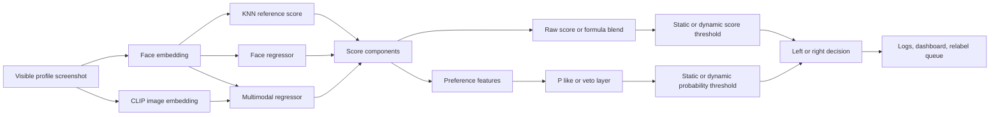

<div align="center">
  <h1>BumbleClaw</h1>
  <p><strong>Dating-app autoswipe tools trained around one person's visual preference.</strong></p>
  <p>
    capture -> label -> embed -> train -> benchmark -> relabel the hard cases -> calibrate live decisions.
  </p>
  <p>
    
    
    
    
  </p>
</div>

> [!IMPORTANT]
> The public workflow should contain the process and tools, not private screenshots, labels, embeddings, fitted models, browser state, or swipe logs from one person's trained behavior. Review tracked artifacts before publishing a clone or release.

BumbleClaw is the autoswipe product I wanted for dating apps: it watches a visible profile from the web or a connected Android phone, scores the profile image with models trained on my visual preference, logs what each model component believed, and can turn that output into a left or right swipe.

The local training journey grew from a small face-similarity experiment into almost 10,000 labeled preference examples, multiple dating-app screenshot re-labeling rounds, binary swipe labels, held-out benchmarks, disagreement-only evaluations, and runtime threshold experiments. The repository keeps that history visible because the product only became useful by following the failures.

It is not a public preference dataset and it is not a portable recommendation model. A model trained from one person's labels is not a general ranking of other people.

Users are responsible for the legality, platform rules, privacy handling, and appropriateness of any data they collect or automate.

<p align="center">
  <a href="#the-journey">Journey</a> |
  <a href="#research-finding">Finding</a> |
  <a href="#pipeline-overview">Pipeline</a> |
  <a href="#replicate-the-process">Replication</a> |
  <a href="#runtime-options">Runtime</a> |
  <a href="#dashboard-and-inspection">Dashboard</a>
</p>

## At A Glance

| Product Surface | What It Does |
| --- | --- |
| Autoswipe runner | Reads dating-app web screenshots or Android screen captures and executes swipe decisions. |
| Preference scorer | Scores visual evidence with KNN, face regressors, multimodal regressors, and blend formulas. |
| Decision engine | Chooses between score thresholds, learned preference probabilities, and dynamic runtime calibration. |
| Training loop | Selects logged screenshots for new ratings, binary swipe labels, and disagreement checks. |
| Inspection layer | Keeps score components, thresholds, screenshots, and setup metadata visible through local reports and a dashboard. |

## The Journey

This repo did not begin as a grand autoswipe system. It started as a face-similarity rater and got more complicated only when the next benchmark or live dating-app session exposed a specific gap.

```text
face similarity
-> 1-5 rating labels
-> supervised face score
-> CLIP-aware screenshot score
-> face-biased blends
-> dynamic score thresholds
-> binary P(like) layer
-> disagreement-only veto labels
-> named experiment setups
```

| Method Step | What Changed | Decision And Reason |
| --- | --- | --- |
| 1. Face-similarity baseline | Start with KNN over labeled InsightFace embeddings. | First prove that my labels could produce a repeatable ranking signal before training heavier models. |
| 2. Face rating model | Train supervised face regressors from the 1-5 visual ratings. | Nearest-neighbor similarity was interpretable but too brittle; a smoother learned score reduced dependence on single references. |
| 3. Multimodal rating model | Add CLIP image signals beside face embeddings. | Dating-app screenshots are not clean portrait benchmarks: crop, pose, lighting, app framing, and image context influence the screenshots the product actually sees. |
| 4. Face-biased blend | Combine face and multimodal ratings instead of trusting one alone. | The product needed an explicit tradeoff between facial preference and broader screenshot semantics. |
| 5. Dating-app screenshot rounds | Curate logged profile screenshots, crop them, label them again, and merge them into training rounds. | Real app screenshots exposed distribution shift from the original reference pool, so the data loop moved closer to runtime inputs. |
| 6. Threshold calibration | Replace one fixed right-swipe boundary with score percentiles over recent logs. | A score cutoff that behaved well in one pool could become too strict or too permissive as the shown profile stream changed. |
| 7. Binary swipe preference layer | Train `P(like)` from score components and actual left/right intent. | A five-point attractiveness score and a real swipe decision are related but not the same target. |
| 8. Formula branches | Test MultimodalX mixes of ridge, multimodal, KNN, and learned probability signals. | I wanted to know whether component blends could improve swipe decisions without hiding the score anatomy. |
| 9. Veto spline layer | Label disagreement-heavy cases and train a decision layer on the hard boundary. | Easy all-left or all-right examples were not where the autoswipe product failed; contested profiles were. |
| 10. Revisit earlier stacks | Re-run earlier scorers under the newer decision layer. | The best base scorer and the best decision layer are separate choices, so an older visual stack can become useful again after the decision method improves. |

The experiment stayed honest about dead ends:

- Fixed thresholds were easier to explain, but runtime score distributions shifted.
- More formula components did not automatically reduce swipe mistakes.
- A learned preference layer could improve a score stack and still feel wrong live if its calibration or training labels were mismatched.
- A multi-model vote sounded attractive, but repeated scoring and repeated history scans have real runtime cost. It should earn its complexity in a benchmark.

The public README intentionally avoids publishing private labels and local validation rows. It keeps the process, the experiment lineage, and the concerns that made each next round necessary.

## Research Finding

### Benchmark accuracy is not the same as live satisfaction

One of the most important findings from this project is that the mathematically strongest model on a held-out table is not automatically the model that feels best in a stochastic live product.

A benchmark compresses behavior into metrics such as error rate, precision, recall, and calibration. Those numbers matter; they prevented me from trusting vibes alone. But a dating-app autoswipe loop is experienced as a stream of decisions. Two models can have similar aggregate quality while producing very different error shapes:

- one model may make fewer total mistakes but disappoint more often on the profiles I care about;
- another may be slightly weaker on a benchmark yet feel more aligned in live browsing because its misses are less costly to my satisfaction;
- dynamic thresholds can preserve a target swipe rate without fixing a model whose ranked ordering feels wrong.

That changed the methodology:

1. Use held-out metrics to reject obviously weak or overfit models.
2. Inspect false positives and false negatives separately, not only a single accuracy number.
3. Validate on real screenshot-domain labels and disagreement cases.
4. Treat live satisfaction as a product criterion after the math clears a minimum bar.

In short: the model should be measurable, but the autoswipe product should still optimize for the user's experienced preference stream.

## Concerns That Shape The Design

### Private data

Profile screenshots, swipe logs, label CSVs, browser state, embedding stores, and fitted preference models can all expose personal information. Keep them outside a public repository. The `.gitignore` is intentionally aggressive around generated images, CSVs, embeddings, models, and logs.

### Rating versus decision

The rating pipeline answers a question like "what numeric visual score would this labeler give this image?" The preference pipeline answers a different question: "given the current score components and prior labels, would this labeler choose right?" The second layer exists because a single `0-100` threshold often misses non-monotonic or context-dependent decisions.

### Screenshot-domain mismatch

Clean reference photos and dating-app screenshots are not the same input distribution. Screenshot rounds exist to test crops, app chrome, visible text, framing, low-quality logs, and profiles near the decision boundary. Keep locked validation examples before training new screenshot rounds.

### Calibration drift

The shown pool can shift during a run. Runtime supports static thresholds and recent-history percentile thresholds over either score values or preference probabilities. Dynamic thresholds are calibration tools; they do not make a weak model accurate by themselves.

### Sensitive attributes

Filtering rules that the app exposes to the user belong in the app settings or explicit profile data path. The visual model should not infer sensitive attributes from appearance as a shortcut.

### Artifact mismatch

A reference store, face regressor, multimodal regressor, preference model, formula score, KNN `k`, crop preset, and threshold policy can be individually valid but wrong together. Named setups keep experimental bundles together after the matching local artifacts have been regenerated.

## Pipeline Overview

The main score components are:

- **KNN**: weighted nearest labeled face embeddings.
- **Face regressor**: a supervised rating model over face embeddings.
- **Multimodal regressor**: a supervised rating model that can use face and CLIP image features.
- **Face-biased score**: a weighted blend of face and multimodal ratings.
- **Preference probability**: a classifier over score components and derived features such as component spread, score bucket, and distance from threshold.



For later experiments the "final score" shown in logs may be a calibrated preference probability scaled to `0-100`, while component scores remain available for debugging and benchmarks.

## Install

The project is Windows-oriented.

Create the base Python environment:

```powershell
python -m venv .venv
.\.venv\Scripts\activate
pip install -r requirements.txt
python -m playwright install chromium
```

InsightFace downloads its local model files on first use.

CLIP-dependent methods require PyTorch and Transformers. The code supports a separate CLIP environment and cache so large model dependencies do not need to live in the public repo. Configure `CLIP_VENV_PYTHON` and `HF_CACHE_DIR` in `face_similarity/clip_runtime.py` for the machine that runs CLIP, then create that environment when needed:

```powershell
$CLIP_VENV = "<path-to-clip-venv>"
python -m venv $CLIP_VENV
& "$CLIP_VENV\Scripts\Activate.ps1"
cd <path-to-bumbleclaw>
pip install -r requirements.txt
pip install -r requirements-clip.txt
python -m playwright install chromium
```

Check ONNX Runtime GPU support:

```powershell
python check_gpu.py
```

`CUDAExecutionProvider` is preferred for live CLIP-assisted runs. CPU mode is useful for simpler checks but will be slower.

## Replicate The Process

### 1. Build a base rating dataset

Start with user-procured images that you are allowed to use. Keep low, neutral, and high examples so the score range is not trained only around one outcome.

The rating label CSV format is:

```csv
path,rating_1_5,rating
data/reference_images/example_001.jpg,5,100
data/reference_images/example_002.jpg,3,50
data/reference_images/example_003.jpg,1,0
```

The numeric mapping used by the rating tools is:

```text
1 = 0
2 = 25
3 = 50
4 = 75
5 = 100
```

Label local source images:

```powershell
python label_app.py --source-dir <path-to-reference-images> --output-csv <path-to-rating-labels.csv>
```

Optional label check:

```powershell
python label_audit.py --min-gap 50 --min-similarity 0.9
```

### 2. Build stores and rating models

Build the face reference store:

```powershell
$RATING_LABELS = "<path-to-rating-labels.csv>"
python build_references.py --labels $RATING_LABELS --provider cuda --det-thresh 0.25
```

Build the aligned CLIP store:

```powershell
python build_clip_store.py `
  --labels $RATING_LABELS `
  --store embeddings\reference_store.npz `
  --output embeddings\clip_store.npz `
  --provider cuda
```

Train face-only rating regressors:

```powershell
python train_regressor.py `
  --store embeddings\reference_store.npz `
  --output models\rating_regressor.joblib `
  --report results\regressor_eval.csv
```

Train face, CLIP, and combined regressors:

```powershell
python train_multimodal_regressor.py `
  --face-store embeddings\reference_store.npz `
  --clip-store embeddings\clip_store.npz `
  --output models\rating_regressor_multimodal.joblib `
  --report results\multimodal_regressor_eval.csv
```

Prefer leak-aware comparisons when repeated people or near-duplicate screenshots may exist across train and validation data.

### 3. Score before automating

Score a folder manually:

```powershell
python score.py .\test_images `
  --method face_biased `
  --store embeddings\reference_store.npz `
  --regressor models\rating_regressor.joblib `
  --multimodal-regressor models\rating_regressor_multimodal.joblib `
  --csv results\scores.csv
```

Check score distributions, prediction failures, and held-out error before connecting a new artifact set to automation.

### 4. Collect screenshot-domain logs

Run the web autoswipe path once on a visible dating-app profile:

```powershell
$LOG_DIR = "<path-to-private-log-dir>"
python bumble_auto.py --log-dir $LOG_DIR
```

The first web run uses a persistent Playwright browser state under `.bumble_browser`. Log in there when needed and keep that state private.

For Android, enable USB debugging and check that `adb devices` can see the phone:

```powershell
python bumble_phone_auto.py --log-dir $LOG_DIR
```

Looping is explicit:

```powershell
python bumble_auto.py --log-dir $LOG_DIR --loop --delay 4
python bumble_phone_auto.py --log-dir $LOG_DIR --loop --delay 4
```

Logs include screenshots and a `scores.csv` with component scores, thresholds, selected setup metadata, and model paths. Treat that directory as private training material.

### 5. Train screenshot rounds

Prepare a logged screenshot round for five-point rating labels:

```powershell
$RATING_ROUND = "<path-to-private-rating-round-workspace>"
python bumble_train.py prepare --source $LOG_DIR --output $RATING_ROUND
```

Label it:

```powershell
python label_app.py `
  --source-dir "$RATING_ROUND\selected" `
  --output-csv "$RATING_ROUND\labels\bumble_labels.csv" `
  --port 7863
```

Combine screenshot labels with the base rating labels:

```powershell
python bumble_train.py combine-labels `
  --base $RATING_LABELS `
  --bumble-labels "$RATING_ROUND\labels\bumble_labels.csv" `
  --manifest "$RATING_ROUND\manifests\selection.csv" `
  --output "$RATING_ROUND\labels\combined_train_labels.csv"
```

Rebuild stores and regressors from the combined label file. Use explicit artifact and report names for each round so old validation results remain comparable.

### 6. Train a binary preference layer

Prepare screenshot-domain binary labels:

```powershell
$PREFERENCE_ROUND = "<path-to-private-preference-round-workspace>"
python bumble_preference.py prepare --source $LOG_DIR --output $PREFERENCE_ROUND
```

Label the prepared images as binary left or right intent, then train:

```powershell
python bumble_preference.py train `
  --manifest "$PREFERENCE_ROUND\manifests\selection.csv" `
  --labels "$PREFERENCE_ROUND\labels\binary_preference_labels.csv" `
  --output models\bumble_preference_classifier.joblib `
  --report results\bumble_preference_benchmark.csv
```

Benchmark score generations with a preference layer on top:

```powershell
python bumble_preference.py benchmark-models `
  --manifest "$PREFERENCE_ROUND\manifests\selection.csv" `
  --labels "$PREFERENCE_ROUND\labels\binary_preference_labels.csv" `
  --preference-model models\bumble_preference_classifier.joblib `
  --output results\preference_top_model_benchmark.csv `
  --best-output results\preference_top_model_best.csv `
  --provider cuda
```

### 7. Evaluate disagreement cases

Later experiments can focus labeling on profiles where several decision paths disagree:

```powershell
python bumble_preference.py prepare-veto-eval --source $LOG_DIR --output <path-to-private-veto-workspace>
```

Use the labeling command printed by that step. Then compare the labeled veto decisions with model outputs:

```powershell
python bumble_preference.py report-veto-eval
python bumble_preference.py benchmark-veto-layers
```

This workflow is useful when easy examples dominate the logs but the real engineering question is which decision layer handles boundary cases better.

## Runtime Options

Named setups in `face_similarity/experimental_setup.py` are lab presets. They are conveniences for a matching local artifact bundle, not universal recommendations. Recreate or replace the referenced stores and fitted models before expecting them to work on another machine.

### Setup Lineage

The setup names preserve the research path instead of rewriting it after every winner changed.

| Setup | Role In The Journey |
| --- | --- |
| `experimental1` | Earlier Round2 face-biased stack with a binary preference layer. |
| `experimental2` | Round3 comparison for the same preference-layer idea. |
| `multimodalx` | Formula score that mixes rating components with an earlier `P(like)` signal. |
| `multimodalx2` | Formula score that adds KNN into that blend. |
| `multimodalx3` | Round3 score components with a disagreement-trained veto-style layer. |
| `multimodalx4` | Veto layer on top of the MultimodalX2-style branch. |
| `multimodalx5` | Another tuned formula branch tested against held-out veto labels. |
| `multimodalx6` | Round2 revisited with the newer veto-spline decision layer. |

That lineage matters because it records the question each setup was trying to answer. It also makes benchmark reports easier to audit when a simpler older branch beats a newer one on a specific validation slice.

Core scoring methods are:

- `knn`
- `regressor`
- `multimodal`
- `face_biased`
- formula methods such as `multimodalx`, `multimodalx2`, and `multimodalx5`

Use explicit flags when overriding a preset deliberately:

```text
--store
--regressor
--multimodal-regressor
--method
--face-weight
--preference-model
--threshold
--dynamic-from-logs
--dynamic-preference-from-logs
```

Dynamic threshold flags can operate on raw score history or on preference-probability history. Keep that distinction clear when interpreting logs.

## Dashboard And Inspection

Open the original Gradio scoring UI:

```powershell
python app.py
```

Run the local Next.js dashboard:

```powershell
cd dashboard
npm install
npm run dev
```

The dashboard reads local score history and screenshots from the automation log directory. Do not deploy a dashboard instance that exposes private logs without reviewing its access boundary.

## Repository Map

| Path | Purpose |
| --- | --- |
| `bumble_auto.py` | Web profile screenshot, score, decision, and keyboard automation |
| `bumble_phone_auto.py` | Android screenshot, score, decision, and ADB swipe automation |
| `face_similarity/` | Embeddings, scoring, regressors, preference features, logging, thresholds |
| `train_regressor.py` | Face-only rating model training |
| `train_multimodal_regressor.py` | Face/CLIP/multimodal rating model training |
| `bumble_train.py` | Screenshot selection, combined labels, and rating evaluation |
| `bumble_preference.py` | Binary preference data, benchmarks, and disagreement experiments |
| `label_app.py` | Five-point and binary local labeling UI |
| `dashboard/` | Local score-history dashboard |

## Practical Notes

- Keep private screenshots, labels, logs, models, and embeddings out of public commits.
- Hold out validation examples before tuning a new score formula or preference layer.
- Rebuild artifact bundles after crop, label, embedding backend, or face-detection changes.
- Treat dynamic percentile settings as a runtime calibration choice and benchmark them against real held-out decisions.
- Prefer a simpler model when it matches the more complicated model on validation and is easier to reason about live.

## Final Warning

This repository is shared for educational research and process replication. It is not a guarantee of platform safety, recommendation quality, match outcomes, or compliance with any dating app's rules. Do your own research and use it at your own risk.
